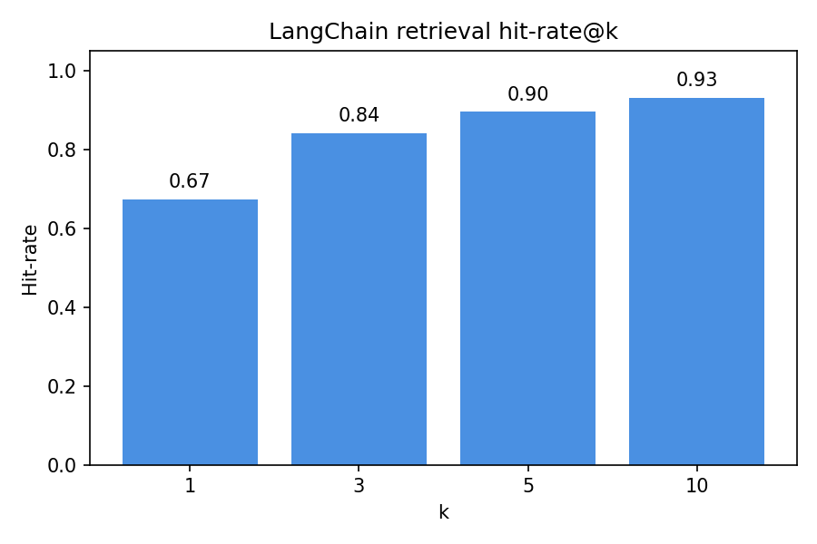

# Retrieval-Augmented Generation (RAG) Starter

This repo keeps a small LangChain RAG loop in one place: ingest some `.txt`/`.md` files, index with FAISS, and query with OpenAI or Ollama. Nothing fancy, just the bits you need.

## Quickstart

1) Install deps (Python 3.10+):
```
python -m venv .venv
source .venv/bin/activate
pip install -r requirements.txt
```

2) Put some text under `data/` (any `.txt`/`.md` files). A sample file is included.

3) Build the LangChain index:
```
python langchain_rag.py ingest --data-dir data --index-path artifacts/langchain_index --embedding-model all-MiniLM-L6-v2
```

4) Query:
```
export OPENAI_API_KEY=sk-...
python langchain_rag.py query --index-path artifacts/langchain_index --question "What is retrieval-augmented generation?" --model gpt-4o-mini
python langchain_rag.py query --index-path artifacts/langchain_index --question "What is retrieval-augmented generation?" --provider ollama --model gemma3:1b
```
Helper script that starts `ollama serve` (if needed) and runs the Ollama query:
```
./run_ollama_and_query.sh "What is retrieval-augmented generation?"
```
The CLI reads files, chunks, embeds, saves to `artifacts/langchain_index/`, retrieves, and answers with citations.

## Evaluate with a Hugging Face dataset (LangChain)
- Quick retrieval check (uses `RecursiveCharacterTextSplitter`, LangChain FAISS, and your chosen embedding model):
```
python langchain_dataset_metrics.py --dataset squad --split "train[:2000]" --sample-size 800 --embedding-model all-MiniLM-L6-v2 --metrics-json artifacts/lc_metrics.json --metrics-plot artifacts/lc_metrics.png
```
- Flags are the usual suspects: tweak `--chunk-size`, `--chunk-overlap`, `--top-k`, and `--embedding-model`. Prints metrics; optionally writes JSON/PNG.

## Evaluation results
- Current sample run (`squad` split `train[:2000]`, 800 examples, `all-MiniLM-L6-v2` embeddings):
  - MRR: 0.764
  - Mean rank: 2.34
  - Samples evaluated: 800
- Plot from the same run (hit-rate + MRR across `k`):


## Web app (questions + metrics)
- Start the Dash UI (uses the LangChain FAISS index at `artifacts/langchain_index`, auto-starts `ollama serve`, and shows metrics inline if found):
```
python app.py
```
- Pick a sample question or type your own. Context shows with scores; answers include citations. Metrics come from `artifacts/lc_metrics.json` if present.
- Defaults: provider=`ollama`, model=`gemma3:1b` (auto-pulled if missing), embedding model=`all-MiniLM-L6-v2`. Override with `WEB_APP_PROVIDER`, `WEB_APP_MODEL`, `WEB_APP_EMBED_MODEL`, `WEB_APP_TOP_K`, or `OLLAMA_BASE_URL`.

## Useful flags
```
python langchain_rag.py ingest --help
python langchain_rag.py query --help
```
Key flags: `--chunk-size`, `--chunk-overlap`, `--embedding-model`, `--top-k`, `--index-path`, `--data-dir`, `--provider`, `--ollama-base-url`.

## Project layout
- `langchain_rag.py` — ingestion, indexing, retrieval, and query CLI (LangChain-based).
- `langchain_dataset_metrics.py` — HF QA evaluator (hit-rate/MRR + optional plot).
- `app.py` — Dash UI to ask questions and view metrics.
- `run_ollama_and_query.sh` — helper to start Ollama (if needed) and run a query with `langchain_rag.py`.
- `requirements.txt` — Python dependencies.
- `data/` — put your source documents here (text/markdown).
- `artifacts/` — (created at runtime) stores the serialized FAISS index and metrics.
